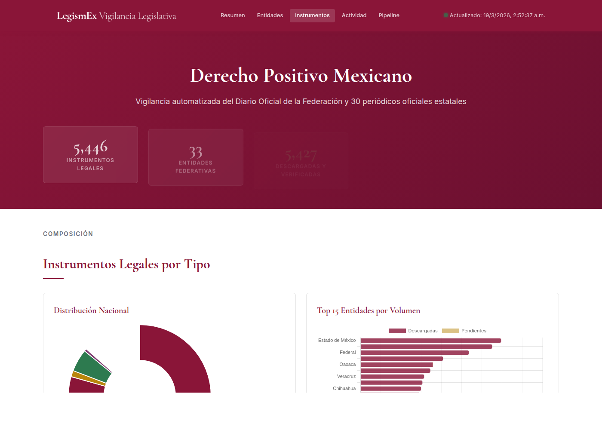

# LegismEx — Vigilancia Legislativa Mexicana

Base de datos completa y sistema de vigilancia automatizado del derecho positivo mexicano: federal + 32 estados. Catálogos de leyes, códigos y reglamentos con URLs de descarga directa, monitoreo diario del DOF y periódicos oficiales estatales, y análisis con IA para detectar reformas.

[](https://philippewhaat.github.io/DerIAMex/)

**[Abrir dashboard interactivo](https://philippewhaat.github.io/DerIAMex/)** — gráficas, tabla de entidades, actividad del DOF, estado del pipeline.

---

## Estado actual

| Métrica | Valor |
|---------|-------|
| Instrumentos legales catalogados | **5,446** |
| Entidades (federal + estados) | **33/33** |
| Descargados y verificados | **5,427** (99.6%) |
| Periódicos oficiales vigilados | **DOF + 30 estados** |
| Análisis con IA | Claude Haiku (Anthropic) |
| Actualización | Diaria a las 11:00 AM CDMX |

---

## Pipeline diario automatizado

El sistema ejecuta 8 pasos cada día como servicio systemd:

```
11:00 AM CDMX
  │
  ├─ 1. Re-scraping de catálogos legislativos (semanal, lunes)
  ├─ 2. Regenerar índice consolidado (leyes_index.json)
  ├─ 3. Vigilar DOF (RSS/XML) + 30 periódicos oficiales estatales
  ├─ 4. Análisis LLM: clasificar cada publicación detectada
  │     → ¿Reforma, adición, derogación, abrogación, ley nueva?
  │     → ¿Qué ley del catálogo afecta? → Acción automática
  ├─ 5. Re-descarga de leyes marcadas como actualizadas
  ├─ 6. Resolución inteligente de pendientes >7 días
  │     → A) Re-scrape del portal del congreso
  │     → B) Extraer texto del DOF
  │     → C) Búsqueda con LLM
  ├─ 7. Reintentos de descargas fallidas
  └─ 8. Regenerar dashboard y publicar (GitHub Pages + sitio web)
```

---

## Cobertura por entidad

| Entidad | Leyes | Descargadas | Fuente |
|---------|------:|------------:|--------|
| Estado de México | 409 | 409 | legislacion.edomex.gob.mx |
| Yucatán | 383 | 383 | congresoyucatan.gob.mx |
| Federal | 315 | 315 | diputados.gob.mx |
| Sonora | 240 | 240 | congresoson.gob.mx |
| Oaxaca | 211 | 210 | congresooaxaca.gob.mx |
| Tlaxcala | 203 | 203 | congresodetlaxcala.gob.mx |
| Veracruz | 185 | 185 | legisver.gob.mx |
| CDMX | 180 | 180 | consejeria.cdmx.gob.mx |
| Chihuahua | 176 | 176 | congresochihuahua.gob.mx |
| Nuevo León | 173 | 173 | hcnl.gob.mx |
| Hidalgo | 165 | 164 | congresohidalgo.gob.mx |
| Sinaloa | 165 | 149 | congresosinaloa.gob.mx |
| Baja California | 163 | 162 | congresobc.gob.mx |
| Baja California Sur | 162 | 162 | cbcs.gob.mx |
| Campeche | 160 | 160 | consejeria.campeche.gob.mx |
| Coahuila | 157 | 157 | congresocoahuila.gob.mx |
| Durango | 157 | 157 | congresodurango.gob.mx |
| Aguascalientes | 153 | 153 | congresoags.gob.mx |
| Puebla | 148 | 148 | ojp.puebla.gob.mx |
| Chiapas | 144 | 144 | congresochiapas.gob.mx |
| San Luis Potosí | 144 | 144 | congresosanluis.gob.mx |
| Morelos | 139 | 139 | marcojuridico.morelos.gob.mx |
| Colima | 138 | 138 | congresocol.gob.mx |
| Guerrero | 133 | 133 | congresogro.gob.mx |
| Tamaulipas | 129 | 129 | congresotamaulipas.gob.mx |
| Zacatecas | 120 | 120 | cgj.zacatecas.gob.mx |
| Nayarit | 119 | 119 | congresonayarit.gob.mx |
| Guanajuato | 117 | 117 | congresogto.gob.mx |
| Querétaro | 111 | 111 | legislaturaqueretaro.gob.mx |
| Michoacán | 97 | 97 | congresomich.gob.mx |
| Jalisco | 74 | 74 | stjjalisco.gob.mx |
| Tabasco | 49 | 49 | congresotabasco.gob.mx |
| Quintana Roo | 27 | 27 | congresoqroo.gob.mx |
| **Total** | **5,446** | **5,427** | |

---

## Estructura

```
DerIAMex/
├── federal/
│   ├── fuentes.md
│   ├── catalogo.json
│   └── catalogo.md
├── estados/
│   └── {estado}/              ← 32 carpetas
│       ├── fuentes.md
│       ├── catalogo.json
│       └── catalogo.md
├── scripts/
│   ├── scraper_catalogo.py           ← Scrapers de 33 portales legislativos
│   ├── generar_indice.py             ← Consolida catálogos → leyes_index.json
│   ├── descarga.py                   ← Descarga con verificación por hash MD5
│   ├── vigilancia_dof.py             ← DOF (RSS) + 30 periódicos estatales
│   ├── analizar_publicaciones.py     ← Clasificación con Claude API
│   ├── resolver_pendientes.py        ← Resolución inteligente (3 estrategias)
│   ├── reintentos.py                 ← Cola de reintentos (máx 3 fallos)
│   ├── generar_dashboard.py          ← Dashboard HTML autocontenido
│   └── run_diario.sh                 ← Orquestador (8 pasos, systemd)
├── leyes_index.json                  ← Índice consolidado (5,446 entradas)
├── dashboard.html                    ← Dashboard interactivo
└── logs/                             ← Logs diarios, alertas, evidencias
```

---

## Uso rápido

```bash
# Pipeline completo (lo que corre diario automáticamente)
./scripts/run_diario.sh

# Solo vigilancia DOF
./scripts/run_diario.sh --solo-dof

# Clasificar sin ejecutar acciones
./scripts/run_diario.sh --dry-run

# Scraping de un estado específico
python3 scripts/scraper_catalogo.py --entidad guanajuato

# Regenerar índice
python3 scripts/generar_indice.py

# Descargar leyes de una entidad
python3 scripts/descarga.py --entidad nuevoleon

# Regenerar dashboard
python3 scripts/generar_dashboard.py
```

---

## Lógica de actualización

Cuando el LLM detecta una reforma en el DOF:

| Fase | Días | Acción |
|------|------|--------|
| Re-descarga | 1-7 | `descarga.py` reintenta desde la URL del catálogo |
| Estrategia A | 8+ | Re-scrape del portal del congreso |
| Estrategia B | 8+ | Extraer texto completo de la nota del DOF |
| Estrategia C | 8+ | Búsqueda inteligente con LLM |
| Persistencia | siempre | Nunca se descarta, se reintenta indefinidamente |

Cada intento queda registrado en `logs/evidencias_reformas.json` para trazabilidad.

---

## Requisitos

- Python 3.10+
- `anthropic` + `python-dotenv` (para análisis LLM)
- Node.js (para build del sitio web, opcional)
- API key de Anthropic en `.env`

---

## Licencia

[Apache License 2.0](LICENSE)
